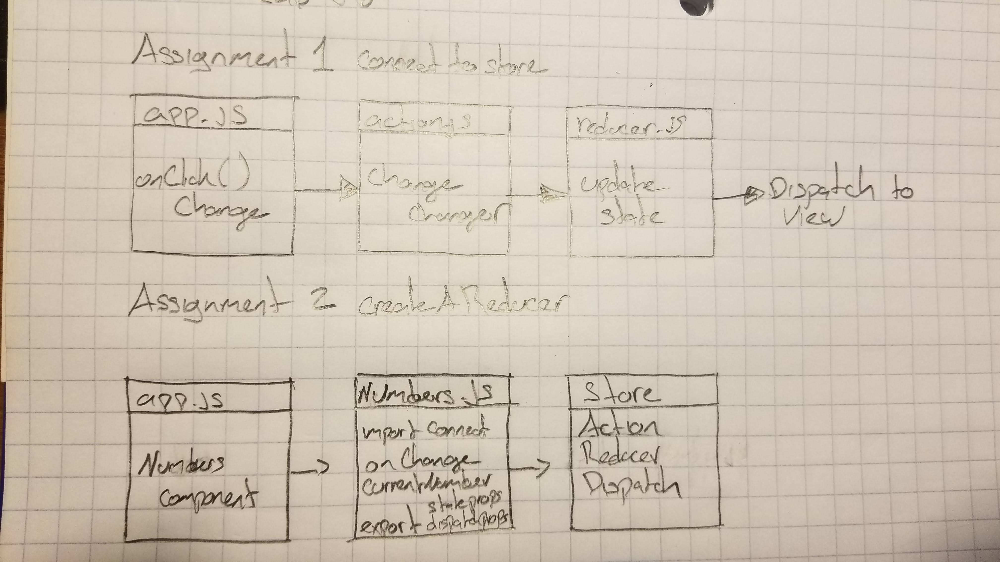

# Lab - Application State

## Felipe Delatorre

### Links and Resources
* [submission PR](http://xyz.com)
* [connectToStore](https://codesandbox.io/s/lab-36-connecttoastore-hi1x8)  
* [createAReducer](https://codesandbox.io/s/lab-36-createareducer-ypu6v)

#### Documentation
* [styleguide] `npm run styleguide` - For each assingment

### Modules
CreateAReducer `Numbers.js`

`mapStateToProps = state => gets state from the store`

`mapDispatchToProps = (dispatch, getState) => gets function from the store`

#### Running the app
* `npm start`

#### UML

